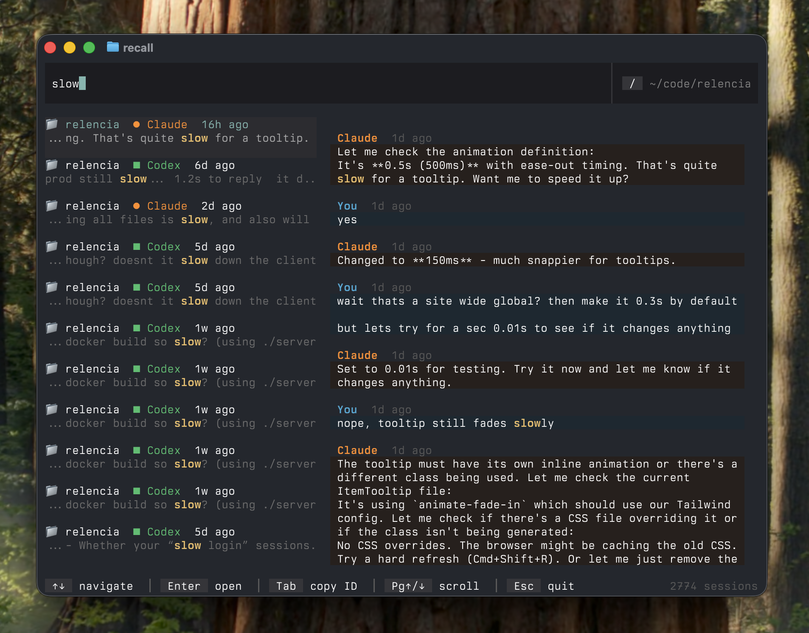
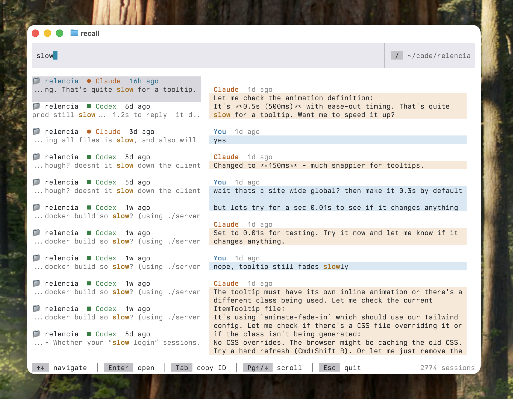

# recall&nbsp;&nbsp;&nbsp;[](https://github.com/hesreallyhim/awesome-claude-code)

Search and resume your Claude Code conversations. Also supports Codex, OpenCode and Factory (Droid).

**Tip**: Don't like reading? Tell your agent to use `recall search --help` and it'll search for you.



## Install

**Homebrew** (macOS/Linux):
```bash
brew install zippoxer/tap/recall
```

**WinGet** (Windows):
```bash
winget install zippoxer.recall
```

**Cargo**:
```bash
cargo install --git https://github.com/zippoxer/recall
```

**Binary**: Download from [Releases](https://github.com/zippoxer/recall/releases)

## Use

Run:
```bash
recall
```

**That's it.** Start typing to search. Enter to jump back in.

| Key | Action |
|-----|--------|
| `↑↓` | Navigate sessions |
| `Pg↑/↓` | Scroll messages |
| `Ctrl+E` | Expand message |
| `Enter` | Resume conversation |
| `Tab` | Copy session ID |
| `/` | Toggle scope (folder/everywhere) |
| `Esc` | Quit |

## Ask it to Search for You
Simply tell your agent:
```
use `recall search --help`
```

Example:
```
pls find me the last conversation where we deployed to staging, use `recall search --help`
```

## MCP
No MCP required. The `recall search` CLI fulfills the same purpose. See [Ask it to Search for You](#ask-it-to-search-for-you).

## Customize

recall's resume commands can be configured with environment variables.

For example, to resume conversations in YOLO mode, add this to your `.bashrc` or `.zshrc`:
```bash
export RECALL_CLAUDE_CMD="claude --dangerously-skip-permissions --resume {id}"
export RECALL_CODEX_CMD="codex --dangerously-bypass-approvals-and-sandbox resume {id}"
```

---



---

Made with ❤️ by [zippoxer](https://github.com/zippoxer) and Claude.
